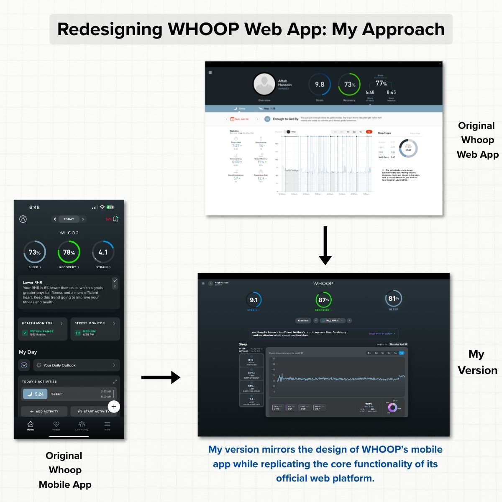
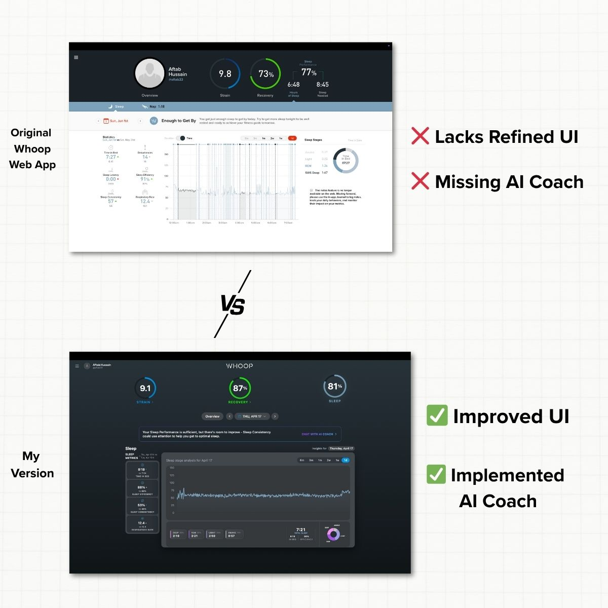

# WHOOP Web App Rebuild with AI Coach

A modern recreation of WHOOP's web platform built with React, featuring enhanced UI/UX design and an intelligent AI coaching system that delivers personalized health insights.



## 🎯 Project Overview

As someone passionate about fitness, technology, and WHOOP's mission, I challenged myself to rebuild their web experience from the ground up. While WHOOP offers an excellent mobile app, their web platform lacked the refined UI and AI coaching features available on mobile.

**What I built:**
- Complete UI/UX recreation mirroring WHOOP's mobile app design
- Enhanced data visualization with interactive charts and analytics
- **AI Coach integration** - the missing piece from WHOOP's web platform
- Real-time personalized health insights using RAG (Retrieval-Augmented Generation)

## 🎨 Design Transformation



### The Problem
WHOOP's original web platform, while functional, lacked the polished UI and AI coaching capabilities that make their mobile app exceptional.

### My Solution
- **✅ Improved UI** - Modern, responsive design with WHOOP's signature aesthetics
- **✅ AI Coach Integration** - Personalized health insights with natural language queries
- **✅ Enhanced Data Visualization** - Interactive charts with multiple time periods (1D-6M)
- **✅ Mobile-First Responsive Design** - Seamless experience across all devices

## 🚀 Live Demo

**👉 [Try the live demo](https://whoopapp.vercel.app)**

## ✨ Key Features

### 🧠 AI Coach Integration
- **Natural language queries** - "How was my sleep last week?" → detailed analysis with trends
- **Personalized recommendations** - contextual advice based on your data patterns
- **Real-time responses** - instant AI-powered coaching using GPT-4o + RAG

### 📊 Comprehensive Health Analytics
- **Sleep Analysis** - detailed sleep stages, efficiency, and heart rate tracking
- **Recovery Monitoring** - HRV, RHR, and recovery scores with period comparisons
- **Strain Tracking** - workout analysis, heart rate zones, and activity breakdown
- **Interactive Visualizations** - responsive charts with tooltips and comparative analytics

### 📱 Modern User Experience
- **Dark theme with WHOOP's signature aesthetics** - professional and sleek interface
- **Mobile-optimized** - touch-friendly interactions and perfect responsive behavior
- **Smooth animations** - polished micro-interactions and transitions

## 🛠️ Technology Stack

**Frontend:** React 18, Vite, Tailwind CSS, Recharts, Lucide React, Date-fns  
**Backend & AI:** Node.js, Express, OpenAI GPT-4o, text-embedding-3-large, Pinecone  
**Deployment:** Google Cloud Run, Vercel

## 🤖 AI Coach Implementation

The standout feature that differentiates this rebuild from WHOOP's current web platform:

1. **Data Processing** - Synthetic WHOOP-style data (sleep, strain, recovery) generated and structured
2. **Vector Embeddings** - Data embedded using OpenAI's text-embedding-3-large model  
3. **Vector Storage** - Embeddings stored in Pinecone for fast similarity search
4. **RAG Pipeline** - User questions analyzed and relevant data retrieved for context
5. **AI Response** - GPT-4o generates personalized, contextual health insights

### Example Interactions
- *"What's my recovery pattern this month?"* → Recovery insights with comparative data
- *"Should I train hard today?"* → Personalized training recommendations
- *"How did my sleep improve over time?"* → Trend analysis with actionable advice

## 🚦 Getting Started

### Prerequisites
- Node.js 18+, OpenAI API key, Pinecone API key

### Quick Setup
```bash
# Clone and install
git clone https://github.com/afthab33/whoop-rebuild.git
cd whoop-rebuild

# Backend setup
cd backend
npm install
# Add your API keys to .env file
npm start

# Frontend setup (new terminal)
cd frontend
npm install
npm run dev

# Open http://localhost:5173
```

### Environment Variables
```bash
# backend/.env
OPENAI_API_KEY=your_openai_api_key
PINECONE_API_KEY=your_pinecone_api_key
PINECONE_ENVIRONMENT=your_pinecone_environment
```

## 🏗️ Project Structure

```
whoop/
├── frontend/           # React app with feature-based architecture
│   ├── src/features/   # ai-coach, dashboard, overview, recovery, sleep, strain
│   ├── src/components/ # Reusable UI components and charts
│   └── src/data/       # Sample WHOOP-style data
├── backend/            # Node.js API server with AI endpoints
└── images/             # README assets
```

## 📝 License

This project is for educational and portfolio purposes. It is not affiliated with or endorsed by WHOOP, Inc.

## 🙏 Acknowledgments

**Built with intensity, driven by ambition, and executed with grit.**

This project reflects my deep admiration for WHOOP's mission and my desire to contribute to the future of health and fitness technology.

---

**Developed by [Aftab Hussain](https://github.com/afthab33)**

*Reimagined WHOOP's web platform with modern UI/UX, AI-powered coaching, and enhanced data visualization.* 